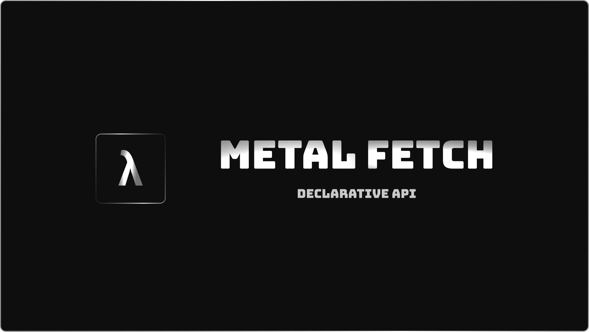

<div align="center">
  
</div>

<h1 align="center">metal-fetch</h1>

<div align="center">
  <strong>A type-safe, fluent, and chainable wrapper around the native Fetch API, designed for maximum flexibility and developer experience.</strong>
</div>

<br />

<div align="center">
  <a href="https://www.npmjs.com/package/@metal-box/fetch"></a>
  <a href="./LICENSE"></a>
</div>

---

**metal-fetch** provides a robust, immutable builder that empowers you to define API endpoints declaratively. It enforces type safety for request bodies, search parameters, and responses, catching errors at compile time, not runtime. With a powerful middleware system and first-class error handling, it's built for creating resilient and maintainable API layers.

## Features

- **⛓️ Fluent, Chainable API:** Define every aspect of a request with a clean, readable, and chainable interface.
- **🔒 Type-Safe by Default:** Enforces validation for request bodies, path parameters, and responses. If you don't define a validator, you can't send the data.
- **✨ Immutable Builder:** Every method on the `FetchBuilder` returns a new, cloned instance, preventing side effects and making your API definitions safe to reuse and extend.
- **🔌 Full-Cycle Middleware:** Intercept and modify requests and responses with a standard `(request, next) => Promise<Response>` middleware pattern. Perfect for logging, authentication, caching, and more.
- **💪 Flexible Response Handling:** Get full control over the raw `Response` object. Inspect headers or check status codes before deciding how to parse the body, preventing crashes from unexpected API responses.
- **🚨 Granular Error Handling:** Define separate handlers for typed fetch errors (like a 404 or 500) and unknown network errors.

## Installation

```bash
# Using pnpm
pnpm add @metal-box/fetch

# Using npm
npm install @metal-box/fetch

# Using yarn
yarn add @metal-box/fetch
```

> **Note:** `metal-fetch` is a runtime-agnostic library. For validation, you can bring your own library, such as `zod`, `yup`, `@metal-box/type`, or any other.

---

## Quick Start

Here's a quick look at defining and using an API endpoint to fetch a user by their ID.

```typescript
import { f } from '@metal-box/fetch'
import { z } from 'zod'

const BASE_URL = 'https://api.example.com'

// Define a validator for the user response
const UserResponse = z.object({
    id: z.string(),
    name: z.string(),
    email: z.string().email(),
})

// 1. Create a reusable API client instance
const apiClient = f
    .builder()
    .def_url(BASE_URL)
    .def_json() // Automatically handle JSON parsing
    .def_query_mode('throw') // Throw an error on non-2xx responses

// 2. Define a specific endpoint
const getUser = apiClient
    .def_method('GET')
    .def_url(`${BASE_URL}/users/$id`) // Dynamic path parameter
    .def_response(async ({ json }) => UserResponse.parse(await json()))
    .build()

// 3. Execute the query
async function fetchUser(userId: string) {
    try {
        const user = await getUser.query({
            path: { id: userId },
        })

        console.log('Fetched User:', user)
        // Type of `user` is inferred as:
        // { id: string; name: string; email: string; }

        return user
    } catch (error) {
        console.error('Failed to fetch user:', error)
    }
}

fetchUser('123')
```

## Core Concepts

### The Immutable Builder

The core of `metal-fetch` is the `FetchBuilder`. It's immutable, meaning every method call creates a new, refined builder instance. This allows you to safely create a base client and extend it for specific endpoints without any side effects.

```typescript
// Base client with shared configuration
const baseClient = f
    .builder()
    .def_url('https://api.my-service.com')
    .def_query_mode('throw')

// Endpoint for fetching products
const getProducts = baseClient
    .def_method('GET')
    .def_url('https://api.my-service.com/products')
    .build()

// Endpoint for creating a product (extends the same baseClient)
const createProduct = baseClient
    .def_method('POST')
    .def_url('https://api.my-service.com/products')
    // ... add body definition
    .build()
```

### Type-Safe Validation

`metal-fetch` helps you eliminate runtime errors by enforcing compile-time checks. You cannot pass a `body` or `search` object to `.query()` unless you have first defined a validator for it.

#### Body Validation

Use `.def_body()` with your favorite validation library.

```typescript
const ProductRequest = z.object({
    name: z.string(),
    price: z.number().positive(),
})

const createProduct = apiClient
    .def_method('POST')
    .def_url(`${BASE_URL}/products`)
    .def_body(ProductRequest.parse) // Pass the validation function
    .build()

// This is now type-safe!
await createProduct.query({
    body: {
        name: 'Laptop',
        price: 1200,
    },
})

// This would cause a TypeScript error, as `body` is not defined
// await getProducts.query({ body: { name: 'Laptop' } });
```

#### Response Validation

Similarly, use `.def_response()` to parse and validate the data you receive. When combined with `.def_json()`, you get a `json()` helper function to safely parse the body.

```typescript
const ProductResponse = z.object({ id: z.string() /* ... */ })

const getProduct = apiClient
    .def_method('GET')
    .def_url(`${BASE_URL}/products/$id`)
    .def_response(async ({ response, json }) => {
        // You can inspect the raw response first
        if (!response.ok) {
            throw new Error(`Request failed with status ${response.status}`)
        }
        // Then parse the body
        return ProductResponse.parse(await json())
    })
    .build()
```

### Path and Search Parameters

- **Path Parameters:** Define dynamic segments in your URL with a `$` prefix (e.g., `/$id`). Pass the corresponding values in the `path` object in `.query()`.
- **Search Parameters:** Use `.def_searchparams()` to define a validator for query strings. Pass the data in the `search` object in `.query()`.

```typescript
const ProductSearch = z.object({
    category: z.string(),
    limit: z.number().optional(),
})

const findProducts = apiClient
    .def_method('GET')
    .def_url(`${BASE_URL}/products`)
    .def_searchparams(ProductSearch.parse)
    .build()

await findProducts.query({
    search: {
        category: 'electronics',
        limit: 10,
    },
})
// Resulting URL: https://api.example.com/products?category=electronics&limit=10
```

## Declarative API Routers

While the `FetchBuilder` is perfect for defining individual endpoints, `metal-fetch` also provides a powerful `router` function to define your entire API surface in a single, organized, and type-safe object. This creates a fully-typed client SDK, eliminating guesswork and ensuring your frontend and backend stay in sync.

The router takes a `baseUrl` and a nested structure of `FetchBuilder` instances. It automatically assigns the URL and HTTP method to each builder based on its position in the tree.

### Example: Defining a Router

```typescript
import { f, type GetRouterConfig } from '@metal-box/fetch'
import { z } from 'zod'

const BASE_URL = 'https://api.example.com'

// Define your validators
const UserResponse = z.object({ id: z.string(), name: z.string() })
const UserListResponse = z.array(UserResponse)
const UserRequest = z.object({ name: z.string() })

// Define the entire API structure
export const api = f.router(BASE_URL, {
    users: {
        GET: f
            .builder()
            .def_json()
            .def_response(async ({ json }) =>
                UserListResponse.parse(await json())
            ),

        POST: f
            .builder()
            .def_json()
            .def_body(UserRequest.parse)
            .def_response(async ({ json }) => UserResponse.parse(await json())),

        // Dynamic path: /users/:id
        $id: {
            GET: f
                .builder()
                .def_json()
                .def_response(async ({ json }) =>
                    UserResponse.parse(await json())
                ),
        },
    },
})

// The `api` object is now a fully-typed client
async function main() {
    // GET /users
    const users = await api.users.GET.query()

    // POST /users
    const newUser = await api.users.POST.query({
        body: { name: 'Jane Doe' },
    })

    // GET /users/123
    const user = await api.users.$id.GET.query({
        path: { id: '123' },
    })
}
```

### End-to-End Type Safety with `GetRouterConfig`

The most powerful feature of the router is its ability to infer types for your entire API. The `GetRouterConfig` utility creates a type definition that maps directly to your router structure.

```typescript
// 1. Export the inferred type from your API definition file
export type ApiConfig = GetRouterConfig<typeof api>

// 2. In another file, you can import and use this type
import { type ApiConfig } from './api'

// You can now extract the exact response type for any endpoint
type GetUsersResponse = ApiConfig['users']['GET']['response']
// `GetUsersResponse` is now:
// Array<{ id: string; name: string; }>

// Or the body type for a POST request
type CreateUserBody = ApiConfig['users']['POST']['body']
// `CreateUserBody` is now:
// { name: string; }
```

This creates a single source of truth for your API's contract, providing autocomplete and compile-time errors if the frontend usage ever diverges from the backend definition.

## Advanced Usage

### Middleware

Middleware allows you to implement cross-cutting concerns. It follows the standard `(request, next) => Promise<Response>` pattern.

```typescript
// An authentication middleware that adds a bearer token
const authMiddleware: f.MiddlewareFunction = async (request, next) => {
    const token = localStorage.getItem('auth_token')
    if (token) {
        request.headers.set('Authorization', `Bearer ${token}`)
    }
    // Continue to the next middleware or the actual fetch call
    return next(request)
}

const secureApiClient = apiClient.def_middleware(authMiddleware)

// All endpoints created from `secureApiClient` will now have the auth header
const getMyProfile = secureApiClient
    .def_method('GET')
    .def_url(`${BASE_URL}/me`)
    .build()
```

### Error Handling

`metal-fetch` provides three distinct handlers for processing outcomes:

- `def_fetch_err_handler`: Handles `FetchResponseError`, which occurs when the server responds with a non-2xx status code (e.g., 404, 500). You get access to the typed error and status code.
- `def_unknown_err_handler`: Catches any other error, such as network failures, DNS issues, or CORS errors.
- `def_final_handler`: A `finally` block that executes after every request, regardless of success or failure. Useful for cleanup logic.

```typescript
const robustClient = apiClient
    .def_fetch_err_handler(({ error, status }) => {
        console.error(
            `[API Error] Status: ${status}, Message: ${error.statusMessage}`
        )
    })
    .def_unknown_err_handler(({ error }) => {
        console.error('[Network Error]', error)
    })
    .def_final_handler(() => {
        console.log('Request finished.')
    })
```

### Aborting Requests

You can easily abort requests using either a timeout or an `AbortSignal`.

```typescript
const controller = new AbortController()

// Abort after 2 seconds
setTimeout(() => controller.abort(), 2000)

try {
    await getUser.query({
        path: { id: '123' },
        // Option 1: Timeout in milliseconds
        timeout: 5000,
        // Option 2: Provide one or more AbortSignals
        abortSignal: controller.signal,
    })
} catch (error) {
    // Catches the abort error
    console.log(error.name) // 'TimeoutError' or 'AbortError'
}
```

## Contributing

Contributions are welcome! Please see the [CONTRIBUTING.md](./CONTRIBUTING.md) file for guidelines.

## License

This project is licensed under the MIT License. See the [LICENSE](./LICENSE) file for details.
